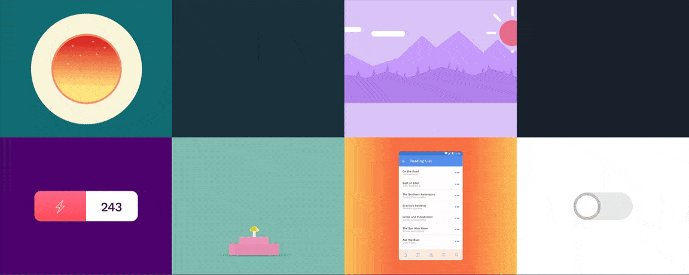
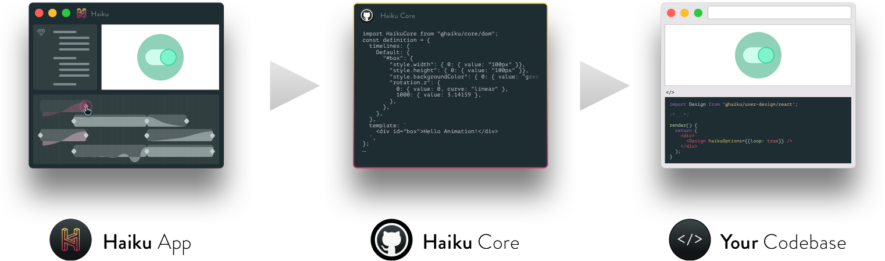

# Haiku Core

Haiku Core is the JavaScript engine that runs [Haiku for Mac](https://haiku.ai). It helps power the Haiku editing experience and also renders the designs you create as animated, interactive components anywhere on the web.

 

  

 

## Developer Preview

[Haiku for Mac](https://haiku.ai) gives designers the power to create web-ready animations, but that's only half the story. The other half is what happens to that animation in your codebase — and that's where Haiku Core comes in.

 

### Interprets Haiku-designed components for rendering on the web

 

  

 

Haiku for Mac turns your designs into components and Haiku Core renders them. Since Haiku Core is built on pure and open web standards (HTML, CSS, JavaScript), your users won't ever need to install a plugin.

 

### Compatible with modern browsers

 

  

 

Haiku Core is compatible with all major modern web browsers: Firefox, Chrome, Safari, and Edge. Its current footprint is ~50K gzipped.

 

### Native support with Lottie

  

[Haiku for Mac](https://haiku.ai) supports exporting to Lottie for native rendering of animations on iOS and Android. Check out [our blog post on Lottie](https://medium.com/haiku-blog/lottie-without-after-effects-9c5a8e74c239) or read more in [our docs.](https://docs.haiku.ai/embedding-and-using-haiku/lottie.html) (Note: Interactions and dynamic components aren't currently supported by Lottie.)

 

### Hackable + compatible with existing codebases

Haiku Core provides a simple and familiar API for runtime manipulation of components that were built in Haiku. You can play and pause animations, react to events, and even pass in dynamic data. (See the [docs](https://docs.haiku.ai) for more info.)

 

### Getting started

Creating a Haiku component begins in Haiku for Mac:

1. Design a component in Haiku for Mac — or ask your designer for a component's Haiku share URL
2. Install the Haiku CLI: `$ yarn global add @haiku/cli` or `$ npm i @haiku/cli --global`
3. Add that component to an existing React or web codebase: `$ haiku install @haiku/yourusername-yourcomponent`
4. Seamlessly update the component as its design changes: `$ haiku upgrade [projectname] [--version=rev]`

**Dev tip:** If you have Haiku for Mac installed, you can also `$ npm link` or `$ yarn link` your Haiku components to make them available to your codebase toolchain's hot reloading hooks. Haiku projects live in `~/.haiku/projects`.

 

#### Direct installation

If you want to install and develop with Haiku Core directly, you can do so with:

    $ npm install @haiku/core

Or via yarn:

    $ yarn add @haiku/core

Haiku Core is also available via Haiku's CDN:

    <!-- specific version -->
    

 

### API / Docs

For our full documentation (a work in progress), please see [docs.haiku.ai](https://docs.haiku.ai). We welcome your contributions [on Github](https://github.com/HaikuTeam/docs).

 

### Usage examples

Simple:

    import HaikuCore from "@haiku/core/dom";
    const definition = {template: {elementName: 'div', children: ['Hello Haiku!']}};
    const factory = HaikuCore(definition);
    const component = factory(document.getElementById("mount"));

Animated:

    import HaikuCore from "@haiku/core/dom";
    const definition = {
      timelines: {
        Default: {
          "#box": {
            "style.width": { 0: { value: "100px" }},
            "style.height": { 0: { value: "100px" }},
            "style.backgroundColor": { 0: { value: "red" }},
            "rotation.z": {
              0: { value: 0, curve: "linear" },
              1000: { value: 3.14159 },
            },
          },
        },
      },
      template: {
        elementName: 'div',
        attributes: {id: 'box'},
        children: ['Hello Animation!'],
      },
    };
    const factory = HaikuCore(definition);
    const component = factory(document.getElementById("mount"));

Interactive:

    import HaikuCore from "@haiku/core/dom";
    const definition = {
      options: {
        autoplay: false,
      },
      states: {
        clicks: {
          value: 0,
        },
      },
      eventHandlers: {
        "#box": {
          "click": {
            handler: function () {
              this.state.clicks += 1;
              this.getTimeline("Default").play();
            },
          },
        },
      },
      timelines: {
        Default: {
          "#box": {
            "content": { 0: { 
              value: function (clicks) {
                return clicks + "";
              },
            }},
            "style.width": { 0: { value: "100px" }},
            "style.height": { 0: { value: "100px" }},
            "style.backgroundColor": { 0: { value: "red" }},
            "rotation.z": {
              0: { value: 0, curve: "linear" },
              1000: { value: 3.14159 },
            },
          },
        },
      },
      template: {
        elementName: 'div',
        attributes: {id: 'box'},
      },
    };
    const factory = HaikuCore(definition);
    const component = factory(document.getElementById("mount"));

 

## Tracking / Analytics

By default, Haiku tracks usage of published components by transmitting metadata to Haiku's Mixpanel account when components are initialized on the page. We send only public information: your component's name, its Haiku account username, the software version it was built with, and its share identifier.

To disable this, set the `mixpanel` option to `false`:

    // ...
    const factory = HaikuCore(definition);
    const component = factory(document.getElementById("mount"), {
      mixpanel: false // Or the string of your own Mixpanel API token
    })

 

## Bugs / Feature Requests / Troubleshooting

Please use [GitHub Issues](https://github.com/HaikuTeam/core/issues).

 

## Contributing

Please send contributions via [pull request](https://github.com/HaikuTeam/core/pulls).

 

## Roadmap

**Code improvements**

- Use arrow functions throughout _(in progress!)_
- Improve test coverage
- Inline source code docs
- Types

**Features**

- Alternative component formats
- Improved Lottie integration
- More comprehensive programmatic API

 

## Development

To develop Haiku Core locally:

1. Fork the repo
2. `$ yarn install`

Compile with:

    $ yarn compile

Test with:

    $ yarn test

Find formatting problems with:

    $ yarn lint

Run demos in your browser:

    $ yarn demos

 

## License / Copyright

MIT. Please refer to LICENSE.txt. Copyright (c) 2016-2018 Haiku Systems Inc.
