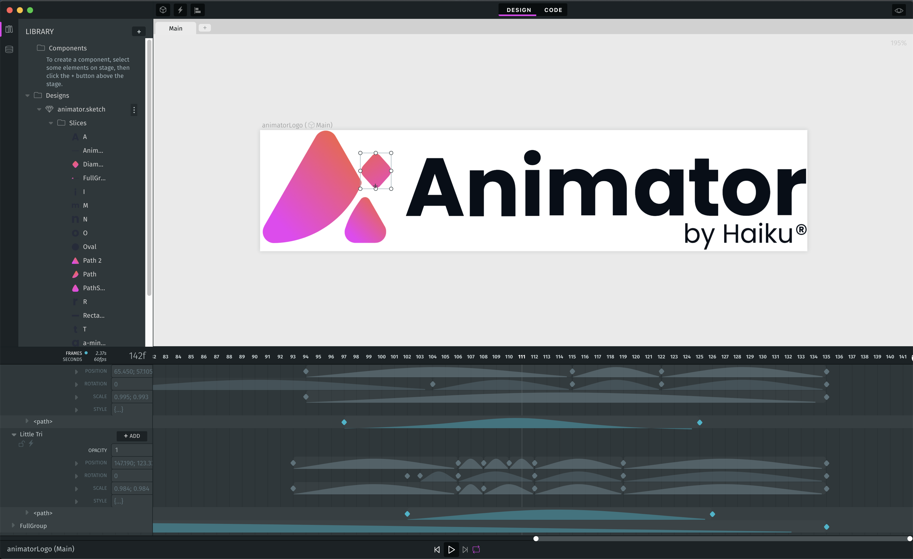

# Haiku Animator

Haiku Animator is a design tool for creating Lottie animations and interactive web components. It's popular among enterprise motion design teams, digital creative studios, and animation classrooms.

Some features:

 - Free-transform canvas for visual vector editing
 - Visual timeline for keyframe animations
 - Exporters for Lottie animations, GIFs, and videos 
 - Asset-linking from Figma, Illustrator, or Sketch
 - Spreadsheet-like property "Expressions" for interactions and animations
 - Code editors for interactive element actions & raw project source




# Installation

👉 Install the latest build from here:  https://github.com/HaikuTeam/animator/releases/ 👈
 
💻 Or run from source by following the `Development` instructions below. 💻


# Development

## 1. Install OS dependencies

It's important to use precise minor version numbers where specified.  `nodegit`/`node-gyp` build errors are expected if you ignore this.

### Mac OS dependencies
1.) nvm:

    $ curl -o- https://raw.githubusercontent.com/creationix/nvm/v0.33.6/install.sh | bash

2.) node 8.15.1:

    $ nvm install 8.15.1 && nvm alias default 8.15.1 && nvm use 8.15.1

3.) yarn 1.13.0:

    $ curl -o- -L https://yarnpkg.com/install.sh | bash -s -- --version 1.13.0

4.) python 2.7 or 3.x (if you need multiple Python environments on your machine, we recommend [pyenv](https://github.com/pyenv/pyenv))

5.) libgcrypt (required for nodegit native bindings)
    $ brew install libgcrypt

### Windows OS dependencies

Assuming a clean Windows 10, open a PowerShell with admin rights:

```
# Install Chocolatey package manager
Set-ExecutionPolicy Bypass -Scope Process -Force; iex ((New-Object System.Net.WebClient).DownloadString('https://chocolatey.org/install.ps1'))

# Install git
choco install git python -y 

# Install nodejs 
choco install nodejs-lts -y --version 8.15.1

# Ignore dependencies to force using specified node version 
choco install yarn -y --version 1.13.0  --ignore-dependencies

# Update PowerShell environment vars
refreshenv

# Install windows build tools (to compile native electron modules, e.g. nodegit)
npm install -g windows-build-tools@2.3.0
```

In Windows is not possible to login in Figma while running Animator in development. In order to connect with Figma, is needed to set an environment variable called `FIGMA_TOKEN` with a Figma token as value.

If the app fails to start because of wrong precompiled binaries, try re-building them (can take some time)

```
yarn electron-rebuild
```


### Linux OS dependencies

* Install a desktop environment like Gnome, XFCE, or KDE if machine does not already have one
* Install dependences from system repositories: `apt install git curl python3 build-essential libgcrypt20 libcurl4-openssl-dev libssl-dev libgtk-3-0 libgconf-2-4 libnss3`
* Install nvm: `curl -o- https://raw.githubusercontent.com/creationix/nvm/v0.33.6/install.sh | bash`
* Install node 8.15.1: `nvm install 8.15.1 && nvm alias default 8.15.1 && nvm use 8.15.1`
* Install yarn 1.13.0: `curl -o- -L https://yarnpkg.com/install.sh | bash -s -- --version 1.13.0`


## 2. Install project dependencies

After you clone the repository, simply run:

    $ yarn install && yarn setup


## 3. Start development server

Assuming you've done the initial setup, you can start all the dev servers with:

    $ yarn start

You can also skip the interactive prompt and start with good defaults with:

    $ yarn go

You can also set some overriding environment variables (e.g. `HAIKU_API`) by making a `.env` file in the mono root. Refer to `.env.example` for an example.

### Watching changes

For the compiler to watch for changes as you develop, run the following command in a separate Terminal tab:

    $ yarn watch-all

### Before committing

First lint all of the code:

    $ yarn lint-all

Then run the unit tests in all of the code:

    $ yarn test-all

You might also want to run:

    $ yarn compile-all

Assuming no lint errors or test failures, push your changes:

    $ git push # and create a pull request

### Debugging

There are configurations included here for debugging any of the UI directly from inside VS Code.

**You must install the `Debugger for Chrome` VS Code extension to use these.  (cmd + shift + p, "install extensions", "Debugger for Chrome")**

To debug, first launch mono normally (see `Starting`) — then from VS Code's left-side Debug menu, select `attach-glass`, `attach-timeline`, or `attach-creator`.  You can then place breakpoints, explore stack traces, explore local values (and more) from inside VS Code.

In general, Plumbing can be debugged on port 9221 and Electron renderer processes can be debugged on port 9222.

### Profiling

To add profile to any code, you should call 

```
logger.time('<user defined name>')
<code to be profiled>
logger.timeEnd('<user defined name>')
```

And it will output
```
<timestamp>|<process>|info|d=149|<user defined name>
```
with `d` being duration between `logger.time` and `logger.timeEnd`. To do a subsequent profile with same name, you should call `logger.time` rearm again.

## Contributing

Create a PR, file an issue, or join the Slack community with [this invite link](https://join.slack.com/t/haiku-community/shared_invite/zt-4u3snz0w-vcL8qttFFHvlrZNl8NSmPg).


## License

Every project you create with Haiku Animator is entirely *yours,* to license or sell or publish however you'd like.

This project's source code is licensed AGPL.


## Status of this project

Animator was developed commercially for several years under Haiku Systems Inc., a software startup based in San Francisco, California with a team spread across the world.  This code was open-sourced in August 2021 when Haiku shut down the commercial collaboration/storage services connected to Haiku Animator.  Previously available features like publishing & sharing links have been removed.

Our hope is that open-sourcing Haiku Animator allows it to be even more useful, to more people (it's free), and lesfor longer (open source).

This project is open to new maintainers.  This codebase isn't perfect.  In fact, in its current state it has deep flaws.  That said, to a dedicated tinkerer, it has potential.  We created it chasing a dream of creative empowerment — we open-source it in hopes of that dream continuing on.

Read more at https://www.haikuanimator.com/
